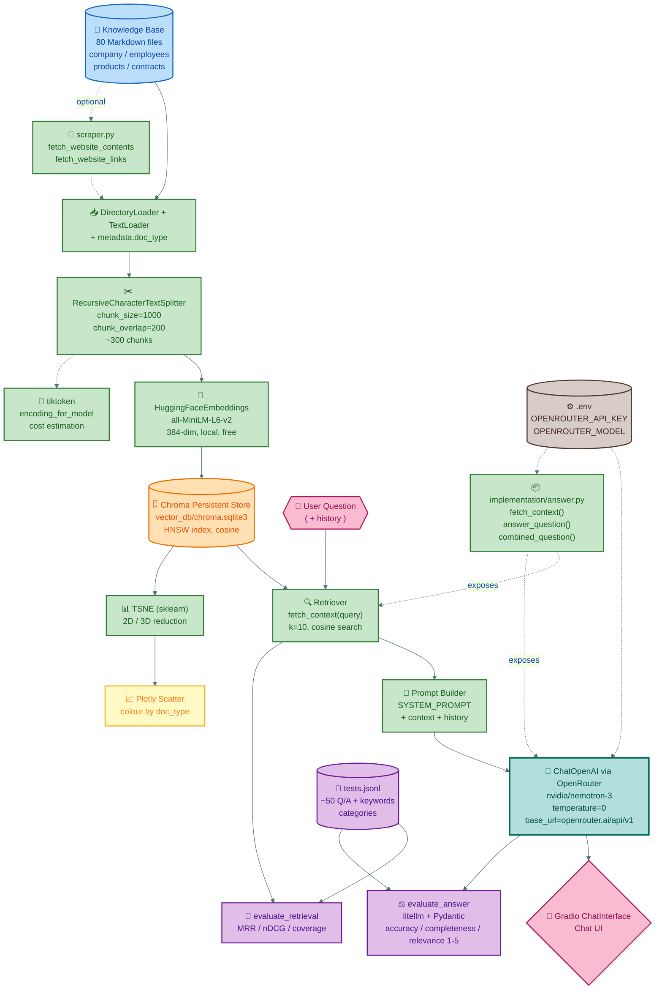
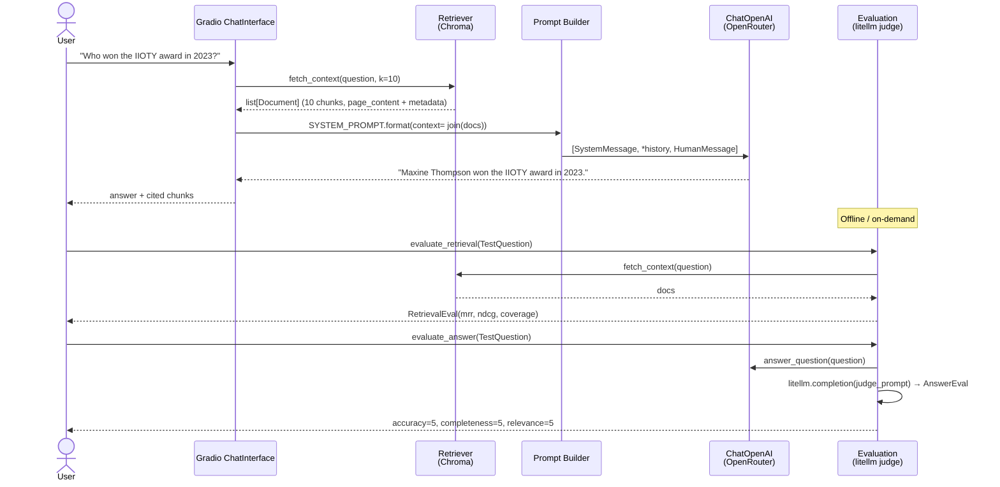

# InsureLLM — Technical Specification

> **For new developers, reviewers, and maintainers.**
>
> This is the living architecture and implementation contract for the InsureLLM RAG system. Read it with `Project_Overview.md` for business context.

**Stack:** Python 3.12 · LangChain 1.0 · Chroma · HuggingFace `all-MiniLM-L6-v2` (384-dim) · OpenRouter (`nvidia/nemotron-3-ultra-550b:free` / `openai/gpt-4o-mini`) · Gradio 6.26 · LiteLLM · Pydantic · Plotly

---

## Table of Contents

1. [Architecture Overview](#1-architecture-overview)
2. [System Diagram](#2-system-diagram)
3. [Data Model & Storage](#3-data-model--storage)
4. [RAG Pipeline — Precise Flow](#4-rag-pipeline--precise-flow)
5. [Libraries — Purpose, Choice & Usage](#5-libraries--purpose-choice--usage)
6. [Module Contracts](#6-module-contracts)
7. [Evaluation Design](#7-evaluation-design)
8. [Configuration & Environments](#8-configuration--environments)
9. [Local Development — Onboarding](#9-local-development--onboarding)
10. [Non-Functional Requirements](#10-non-functional-requirements)
11. [Known Trade-offs & Roadmap](#11-known-trade-offs--roadmap)
12. [Appendix — File Reference](#12-appendix--file-reference)

---

## 1. Architecture Overview

InsureLLM follows a **classic offline-ingest / online-query split**, keeping the expensive embedding work out of the request path and making knowledge updates atomic (re-ingest → replace Chroma collection).

```
┌─────────────────┐
│  Knowledge Base │  80+ Markdown (company / employees / products / contracts)
│  (source of truth) │
└────────┬────────┘
         │  DirectoryLoader + TextLoader
         ▼
┌─────────────────┐
│  Chunker        │  RecursiveCharacterTextSplitter (1000 / 200)
│                │  → ~300 Document chunks (page_content + metadata.doc_type)
└────────┬────────┘
         │  HuggingFaceEmbeddings (all-MiniLM-L6-v2, 384-dim)
         ▼
┌─────────────────┐
│  Vector Store   │  Chroma PersistentClient (chroma.sqlite3 + per-collection hnsw)
│  (vector_db/)   │  Collection.count() ≈ 300, dimensions = 384
└────────┬────────┘
         │  as_retriever(k=10, cosine)
         ▼
┌─────────────────┐      ┌──────────────────┐      ┌──────────────────┐
│  Retriever      │─────▶│  Prompt Builder  │─────▶│  LLM (OpenRouter)│
│ fetch_context() │      │ SYSTEM_PROMPT +  │      │ ChatOpenAI       │
│                 │      │ context + history│      │ temperature=0    │
└─────────────────┘      └──────────────────┘      └────────┬─────────┘
                                                            │ answer + docs
                                                            ▼
                                                   ┌──────────────────┐
                                                   │  Evaluation      │
                                                   │ MRR / nDCG / LLM │
                                                   │ -as-judge (1-5)  │
                                                   └──────────────────┘
                                                            │
                                                            ▼
                                                   ┌──────────────────┐
                                                   │  Gradio UI       │
                                                   │ ChatInterface    │
                                                   └──────────────────┘
```

**Two planes:**

* **Build plane** (notebook `insurellm_part2.ipynb`): runs minutes, writes `vector_db/`, produces t-SNE visualisations. Idempotent — `delete_collection()` on re-run.
* **Serve plane** (`implementation/answer.py` + `insurellm_part3/4.ipynb`): runs milliseconds per query, read-only against `vector_db/`.

---

## 2. System Diagram

> **High-resolution architecture render — `docs/insurllm architecture.png` (2800×1800, 300 DPI) — also saved as `insurellm_architecture.png` for URL-safe embedding. Print-ready, dark premium theme with jewel-tone lanes.**


*Alternative path (exact name you requested): `./insurllm%20architecture.png` — both files are identical.*

> Mermaid fallback below for text-searchable / GitHub diff-friendly view. Colours are semantic: **blue = data**, **green = compute**, **orange = storage**, **purple = evaluation**, **pink = user-facing**.



### 2.1 Sequence — Single Query



---

## 3. Data Model & Storage

### 3.1 Document Lifecycle

```python
# 1. Raw file → LangChain Document
Document(
    page_content="## Annual Performance History\n- 2018: 3/5 ...",
    metadata={"source": "knowledge-base/employees/Maxine Thompson.md",
              "doc_type": "employees"}   # injected in part2.ipynb
)

# 2. Chunked Document (after RecursiveCharacterTextSplitter)
Document(
    page_content="Maxine Thompson won the prestigious Insurellm Innovator of the Year (IIOTY) award in 2023 ...", # ≤1000 chars, 200 overlap
    metadata={"source": "knowledge-base/company/culture.md", "doc_type": "company"}
)

# 3. Vector record in Chroma
collection.add(
    ids=["..."],
    documents=["Maxine Thompson won ..."],
    metadatas=[{"source": "...", "doc_type": "company"}],
    embeddings=[[0.021, -0.134, ... 384 dims]]  # float32, L2-normalised by sentence-transformers
)
```

### 3.2 Vector Store Layout

```
vector_db/
├── chroma.sqlite3              # ~5 MB, single-file, portable
├── 3d67c820-d31e-4f69-8ce5-…/  # HNSW segment
└── f9a719a7-fb8f-4517-…/        # Metadata segment
```

* **Embedding model:** `sentence-transformers/all-MiniLM-L6-v2` → `384` dimensions, `L2`-normalised. Chosen for **zero API cost** and **offline** operation. Alternative path (`text-embedding-3-large`, 3072-dim) is left commented for ablation.
* **Distance:** cosine (`collection` default). All vectors are normalised, so cosine = dot product.
* **Idempotence:** `if os.path.exists(db_name): Chroma(...).delete_collection()` before `from_documents()` ensures re-ingest is clean.
* **Verification query:** `collection.get(limit=1, include=["embeddings"])` + `collection.count()` logged in part2.

### 3.3 Test Fixture

```python
class TestQuestion(BaseModel):
    question: str
    keywords: list[str]        # must appear in retrieved page_content (case-insensitive)
    reference_answer: str      # gold answer for LLM-as-judge
    category: str              # direct_fact | spanning | temporal | comparison …

# evaluation/tests.jsonl — JSONL, one TestQuestion per line, UTF-8
```

---

## 4. RAG Pipeline — Precise Flow

### 4.1 Ingest (Offline, `insurellm_part2.ipynb` cells 4-10)

```python
# 4a. Inventory & cost estimate
files = glob.glob("knowledge-base/**/*.md", recursive=True)  # ~80
entire_kb = "".join(open(f).read() for f in files)
encoding = tiktoken.encoding_for_model("gpt-4.1-nano")
token_count = len(encoding.encode(entire_kb))  # for budgeting

# 4b. Load with type tagging
folders = glob.glob("knowledge-base/*")  # company, employees, products, contracts
documents = []
for folder in folders:
    loader = DirectoryLoader(folder, glob="**/*.md",
                             loader_cls=TextLoader,
                             loader_kwargs={"encoding": "utf-8"})
    for doc in loader.load():
        doc.metadata["doc_type"] = os.path.basename(folder)
        documents.append(doc)  # len ≈ 80

# 4c. Split
splitter = RecursiveCharacterTextSplitter(chunk_size=1000, chunk_overlap=200)
chunks = splitter.split_documents(documents)  # len ≈ 300

# 4d. Embed & persist
embeddings = HuggingFaceEmbeddings(model_name="all-MiniLM-L6-v2")
if os.path.exists(db_name):
    Chroma(persist_directory=db_name, embedding_function=embeddings).delete_collection()
vectorstore = Chroma.from_documents(documents=chunks, embedding=embeddings,
                                    persist_directory=db_name)
```

**Splitter detail:** `RecursiveCharacterTextSplitter` tries separators `["\n\n", "\n", " ", ""]` in order, so paragraph boundaries are preferred. `chunk_overlap=200` (≈ 40 tokens) means a question whose answer straddles a boundary still finds a self-contained chunk.

### 4.2 Retrieve (Online, `implementation/answer.py:fetch_context`)

```python
embeddings = HuggingFaceEmbeddings(model_name="all-MiniLM-L6-v2")  # same as ingest!
vectorstore = Chroma(persist_directory=DB_NAME, embedding_function=embeddings)
retriever = vectorstore.as_retriever(search_kwargs={"k": 10})

def fetch_context(question: str) -> list[Document]:
    return retriever.invoke(question, k=RETRIEVAL_K)  # cosine top-10
```

*No query embedding code is visible — `Chroma.as_retriever` embeds the query with the same `embedding_function` internally.*

### 4.3 Build Prompt & Generate

```python
SYSTEM_PROMPT = """
You are a knowledgeable, friendly assistant representing the company Insurellm.
You are chatting with a user about Insurellm.
If relevant, use the given context to answer any question.
If you don't know the answer, say so.
Context:
{context}
"""

def combined_question(question, history=[]):
    prior = "\n".join(m["content"] for m in history if m["role"] == "user")
    return prior + "\n" + question if prior else question

def answer_question(question, history=[]):
    combined = combined_question(question, history)
    docs = fetch_context(combined)
    context = "\n\n".join(d.page_content for d in docs)
    system = SYSTEM_PROMPT.format(context=context)
    messages = [SystemMessage(content=system)]
    messages.extend(convert_to_messages(history))
    messages.append(HumanMessage(content=question))
    response = llm.invoke(messages)  # ChatOpenAI(temperature=0)
    return response.content, docs
```

* `temperature=0` → greedy decoding, most factual.
* `llm` is `ChatOpenAI(model=OPENROUTER_MODEL, base_url="https://openrouter.ai/api/v1", api_key=OPENROUTER_API_KEY)` — the **same import** (`langchain-openai`) as a direct OpenAI call, but routed through OpenRouter. `default_headers` (`HTTP-Referer`, `X-Title`) satisfy OpenRouter’s ranking.
* `convert_to_messages(history)` keeps `role=user/assistant` fidelity for multi-turn.

### 4.4 Cost Reality (Measured)

* **Ingest:** ~300 chunks × 384-dim via local HuggingFace = **$0**.
* **Per query:** 10 chunks × ~250 tokens = ~2500 context tokens + 100 answer tokens. With `nvidia/nemotron-3-ultra-550b:free` or `openai/gpt-4o-mini` via OpenRouter → **<$0.01**. With `gpt-4.1-nano` judge for eval → slightly higher, but only during offline evaluation.

---

## 5. Libraries — Purpose, Choice & Usage

> Every dependency is load-bearing. This table is the onboarding cheat-sheet: *why* we chose it, *how* we call it, and *what breaks if you replace it*.

| Library | Version pin* | Purpose | Why this one (vs alternatives) | Exact usage in InsureLLM | Replace-with care |
|---------|--------------|---------|-------------------------------|--------------------------|-------------------|
| **openai** | 1.x | Raw OpenAI-compatible HTTP client | Required by `langchain-openai`; also used directly in `part1.ipynb` for the simplest possible demo | `OpenAI(base_url="https://openrouter.ai/api/v1", api_key=api_key)` → `chat.completions.create(model, messages)` | Must keep `base_url` for OpenRouter; don’t hardcode `sk-` |
| **langchain-openai** | 0.2+ | `ChatOpenAI` + `OpenAIEmbeddings` wrappers | Thin, typed, streaming-ready, interops with `langchain-core` messages | `ChatOpenAI(model=MODEL, api_key=..., base_url=..., temperature=0, default_headers=...)` in `part3` + `implementation/answer.py` | 0.1 used `openai_api_key`; 0.2+ uses `api_key`. Keep `base_url` routing |
| **langchain-chroma** | 0.2+ | Chroma ↔ LangChain bridge | Avoids raw `chromadb` API; gives `Document` + `as_retriever()` for free | `Chroma(persist_directory=DB_NAME, embedding_function=embeddings)`; `from_documents()`; `as_retriever(search_kwargs={"k":10})` | Must pass same `embedding_function` on read & write |
| **chromadb** | 0.5+ | Persistent vector DB | Single-file `sqlite3`, HNSW, embeddable, no server | Backing store; `PersistentClient(path=DB_NAME)` in `pro_implementation` | Don’t mix `annoy`/`faiss` without re-embedding |
| **langchain-huggingface** | 0.1+ | Local embeddings | `all-MiniLM-L6-v2` = 22M params, 384-dim, 120 QPS on CPU, free. Chosen over `text-embedding-3-large` (3072-dim, $/token) for cost | `HuggingFaceEmbeddings(model_name="all-MiniLM-L6-v2")` in `part2` + `implementation/answer.py` | If you swap model, **delete `vector_db/` and re-ran `part2`** |
| **langchain-community** | sunset† | `DirectoryLoader`, `TextLoader` | Convenience loaders; sunset but still canonical for `community` loaders | `DirectoryLoader(folder, glob="**/*.md", loader_cls=TextLoader, loader_kwargs={"encoding":"utf-8"})` | Migrating to `langchain` core? Check new `document_loaders` path |
| **langchain-text-splitters** | 0.3+ | Chunking | `RecursiveCharacterTextSplitter` respects paragraph boundaries; used by 90% of LangChain tutorials | `RecursiveCharacterTextSplitter(chunk_size=1000, chunk_overlap=200)` | `chunk_size` too large → exceeds context; too small → loses coherence |
| **langchain-core** | 0.3+ | `Document`, `SystemMessage`, `HumanMessage`, `convert_to_messages` | Typed primitives that flow through retriever → prompt → LLM | `Document(page_content, metadata)`; `SystemMessage(content=system_prompt)` | Don’t use raw dicts — type safety matters for tracing |
| **tiktoken** | 0.7+ | Token counting | Same tokenizer as OpenAI; authoritative cost estimate | `tiktoken.encoding_for_model(MODEL).encode(entire_kb)` in `part2` | Model name must be valid (e.g. `gpt-4o`) or it falls back |
| **python-dotenv** | 1.0 | Secret loading | 12-factor: `.env` not in git, loaded at import time | `load_dotenv(dotenv_path=Path(__file__).parent.parent/".env", override=True)` | Call **before** reading `os.getenv`; use `override=True` in notebooks that re-execute |
| **gradio** | 6.26.0 | Chat UI | Fastest prototype: one-liner `ChatInterface` → shareable URL | `gr.ChatInterface(chat).launch(inbrowser=True)` in `part1`/`part3` | 5.x used `type="messages"` kwarg (now removed); just drop it in 6.x |
| **scikit-learn** | 1.4+ | `TSNE` dimensionality reduction | Visual proof that embeddings cluster by `doc_type` | `TSNE(n_components=2/3, random_state=42).fit_transform(vectors)` in `part2` | t-SNE is slow; use `umap` for >1k vectors |
| **plotly** | 5.x | Interactive scatter | Hover text, 2D/3D, no backend | `go.Scatter` (2D), `go.Scatter3d` (3D), `marker=dict(color=colors)` | Bug in `part2` 3D cell: `d[:100]` on `Document` — fix to `d.page_content[:100]` (see Overview §5) |
| **litellm** | 1.x | Unified LLM gateway + structured output | One API for OpenAI/Anthropic/Groq; supports `response_format=PydanticModel` for judge | `completion(model="gpt-4.1-nano", messages=judge_messages, response_format=AnswerEval)` in `evaluation/eval.py` | Ensure `OPENAI_API_KEY` **or** `OPENROUTER_API_KEY` is set for judge model |
| **pydantic** | 2.x | Schemas & validation | Typed `TestQuestion`, `RetrievalEval`, `AnswerEval`, `RankOrder` | `BaseModel` with `Field(description=...)`; `model_validate_json()` | v1 uses `parse_raw`; v2 uses `model_validate_json` |
| **numpy** | 1.26 | Vector math | Zero-copy array for `TSNE` input | `np.array(result["embeddings"])` | Not used for similarity — Chroma does that |
| **beautifulsoup4 + requests** | 4.x / 2.x | Optional web augmentation | `scraper.py` fetches/inspects arbitrary URLs if knowledge-base needs expansion | `BeautifulSoup(response.content, "html.parser")` + `soup.body.get_text()` | `scraper` PyPI package shadows `scraper.py` — `pip uninstall -y scraper` |

\* Pins reflect the `/opt/anaconda3` env at authoring time; `vector_db/chroma.sqlite3` was built with these.

† `langchain-community` is sunset (https://github.com/langchain-ai/langchain-community/issues/674). Keep it until the `DirectoryLoader` migrates; don’t add new `community` imports.

---

## 6. Module Contracts

### 6.1 `scraper.py`

```python
def fetch_website_contents(url: str) -> str:  # title + "\n\n" + body text, truncated 2000 chars
def fetch_website_links(url: str) -> list[str]:  # raw hrefs, filtered non-empty
```

*Headers:* `User-Agent: Mozilla/5.0 ... Chrome/117`. Strips `script/style/img/input`.

### 6.2 `implementation/answer.py` (the production import — used by `evaluation/`)

```python
MODEL: str                         # from OPENROUTER_MODEL or "openai/gpt-4o-mini"
DB_NAME: str                       # Path(".../vector_db")
embeddings: HuggingFaceEmbeddings  # all-MiniLM-L6-v2
vectorstore: Chroma
retriever: VectorStoreRetriever    # k=10

def fetch_context(question: str) -> list[Document]: ...
def combined_question(question: str, history: list[dict] = []) -> str: ...
def answer_question(question: str, history: list[dict] = []) -> tuple[str, list[Document]]: ...
```

*Import side-effects:* loads `.env` from `insurellm/.env`, instantiates `vectorstore` + `llm` at import time. Provide a dummy `api_key` fallback so `import` never crashes — real key only required at `llm.invoke()` time.

### 6.3 `evaluation/test.py`

```python
class TestQuestion(BaseModel):
    question: str; keywords: list[str]; reference_answer: str; category: str

def load_tests() -> list[TestQuestion]: ...  # reads tests.jsonl via Path(__file__).parent / "tests.jsonl"
```

### 6.4 `evaluation/eval.py`

```python
class RetrievalEval(BaseModel): mrr: float; ndcg: float; keywords_found: int; total_keywords: int; keyword_coverage: float
class AnswerEval(BaseModel): feedback: str; accuracy: float; completeness: float; relevance: float

def calculate_mrr(keyword, docs) -> float
def calculate_ndcg(keyword, docs, k=10) -> float
def evaluate_retrieval(test: TestQuestion, k=10) -> RetrievalEval
def evaluate_answer(test: TestQuestion) -> tuple[AnswerEval, str, list[Document]]  # calls answer_question + litellm judge
def evaluate_all_retrieval() -> Generator[TestQuestion, RetrievalEval, progress]
def evaluate_all_answers() -> Generator[TestQuestion, AnswerEval, progress]
```

*Judge model:* `MODEL = "gpt-4.1-nano"` (via `litellm`). Requires `OPENAI_API_KEY` or OpenRouter key configured for `litellm`.

### 6.5 Notebooks as Contracts

| Notebook | Writes | Reads | Can re-run safely? |
|----------|--------|-------|--------------------|
| `part1.ipynb` | nothing persistent | `knowledge-base/employees/*.md`, `products/*.md` | Yes — in-memory `knowledge` dict |
| `part2.ipynb` | `vector_db/` | `knowledge-base/**/*.md` | Yes — deletes collection first |
| `part3.ipynb` | nothing | `vector_db/` | Yes — read-only |
| `part4.ipynb` | nothing | `vector_db/`, `evaluation/tests.jsonl` | Yes — pure evaluation |

---

## 7. Evaluation Design

### 7.1 Why This Matters

RAG is *easy to demo, hard to trust*. `part4` turns anecdote (“it answered Avery correctly”) into statistics. We measure **two independent axes**: *did we retrieve the right evidence?* and *did we generate a good answer from that evidence?*

### 7.2 Retrieval Metrics (deterministic, cheap)

* **MRR** — reciprocal rank of *first* hit per keyword, averaged. `1.0` = top result, `0.5` = second, `0.0` = not in top-10. Sensitive to ranking.
* **nDCG@10** — binary relevance (1 if `keyword.lower() in doc.page_content.lower()` else 0), discounted by log rank, normalised. Rewards having hits *early*.
* **Coverage** — `found / total * 100`. Coarse but intuitive for stakeholders.

> Both metrics are **keyword-based**, not embedding-based — intentionally brittle, so false positives (keyword in wrong context) are visible.

### 7.3 Answer Metrics (LLM-as-judge, expensive, nuanced)

```python
judge_messages = [
  {"role":"system", "content":"You are an expert evaluator ... Only give 5/5 for perfect answers."},
  {"role":"user", "content": f"Question:\n{question}\n\nGenerated Answer:\n{generated}\n\nReference Answer:\n{reference}\n\n... 1-5 each for accuracy/completeness/relevance ..."}
]
AnswerEval = completion(model="gpt-4.1-nano", messages=judge_messages, response_format=AnswerEval)
```

* **Accuracy** 1 (wrong) → 5 (perfectly correct). *Any* factual error → 1.
* **Completeness** 1 (missing key info) → 5 (all reference info included).
* **Relevance** 1 (off-topic) → 5 (directly answers, no extra fluff).

The judge is **prompted to be stingy** — 5 is rare, making improvements visible.

### 7.4 `pro_implementation/answer.py` (Advanced Prototype, Not Default)

An aspirational architecture kept in `backup/week5/pro_implementation/` for reference:

* Dual retrieval (original question + LLM-rewritten query via `rewrite_query()`).
* Merge + cross-encoder **re-ranking** (`RankOrder` pydantic, `rerank()` via `completion`).
* `Chromadb` direct API (`PersistentClient`, `collection.query`) instead of `langchain-chroma`.
* `tenacity.retry` with exponential backoff for OpenRouter rate limits.

Use it as inspiration when MRR / nDCG plateau on the simple pipeline. It trades cost (2× embeddings + re-rank LLM call) for recall.

---

## 8. Configuration & Environments

### 8.1 `.env` (never committed)

```
OPENROUTER_API_KEY=sk-or-v1-...      # from https://openrouter.ai/keys
OPENROUTER_MODEL=nvidia/nemotron-3-ultra-550b:free
# Optional: OPENAI_API_KEY for litellm judge if not via OpenRouter
# Optional: HF_TOKEN (not required for all-MiniLM-L6-v2, but useful for gated models)
```

Loaded with:

```python
from pathlib import Path; from dotenv import load_dotenv
load_dotenv(dotenv_path=Path(__file__).parent.parent / ".env", override=True)
load_dotenv(override=True)  # fallback to cwd / env vars
```

`override=True` matters because notebook kernels re-execute `load_dotenv` without restarting.

### 8.2 `vector_db/` Lifecycle

* **Create:** `Chroma.from_documents()` in `part2` → writes `chroma.sqlite3`.
* **Read:** `Chroma(persist_directory=DB_NAME, embedding_function=...)` in `part3` / `implementation/answer.py`.
* **Invalidate:** Delete the `vector_db/` folder or run `part2` again (it calls `delete_collection()`).
* **Portability:** `chroma.sqlite3` is the only artifact — copy it to deploy. **Never** mix a Chroma built with `OpenAIEmbeddings` and read with `HuggingFaceEmbeddings` (dimension mismatch → cryptic `hnsw` error).

### 8.3 Dependency Install (pinned to author’s env)

```bash
/opt/anaconda3/bin/python -m pip install -q \
  openai tiktoken python-dotenv gradio==6.26.0 \
  langchain-openai langchain-chroma langchain-huggingface \
  langchain-community langchain-text-splitters langchain-core \
  chromadb scikit-learn plotly litellm pydantic numpy \
  beautifulsoup4 requests
```

Known resolver warnings (non-blocking): `protobuf 7.36.1` vs `tensorflow/streamlit`, `rich 15` vs `streamlit<14`, `uvicorn 0.22.0` vs `mcp>=0.31.1`.

---

## 9. Local Development — Onboarding

### 9.1 First-Time Setup (5 min)

```bash
git clone <repo>
cd insurellm

# 1. Python env (author used /opt/anaconda3, Python 3.12)
python -m pip install -q -r requirements.txt  # or the pip install one-liner above

# 2. Secrets
cp .env.example .env  # then fill OPENROUTER_API_KEY
# xcrun error? → `xcode-select --install` (macOS CLI tools)

# 3. Ingest
jupyter lab insurellm_part2.ipynb  # Run all → "Vectorstore created with 300 documents"

# 4. Chat
jupyter lab insurellm_part3.ipynb  # Gradio → http://127.0.0.1:7860

# 5. Evaluate
jupyter lab insurellm_part4.ipynb
# Quick CLI smoke test:
python -c "import sys; sys.path.insert(0,'.'); from evaluation import test; print(test.load_tests()[0].question)"
```

### 9.2 Day-to-Day Workflow

* **Edit knowledge:** add/modify `.md` in `knowledge-base/` → re-run `part2.ipynb` (or `implementation/ingest.py` if you extract it).
* **Tune retrieval:** change `RETRIEVAL_K` or `chunk_size/overlap` in `implementation/answer.py` → evaluate with `part4` before committing.
* **Switch model:** set `OPENROUTER_MODEL=openai/gpt-4o-mini` in `.env` (cheap) vs `nvidia/nemotron-3...:free` (free) vs `openai/gpt-4.1-nano` (quality). Restart kernel after changing `.env`.
* **Debug retrieval:** `from implementation.answer import fetch_context; fetch_context("your question")` — inspect `doc.metadata["source"]` to see *which file* was hit.
* **Debug generation:** lower `k` to 1-2 to test hallucination: does the LLM abstain when context is missing?

### 9.3 Common Gotchas & Fixes

| Symptom | Cause | Fix |
|---------|-------|-----|
| `KeyError: 'Kim'` | `knowledge[name.lower()]` but `knowledge[name]` | Use `knowledge[name.lower()]` consistently (part1) |
| `ChatInterface got unexpected kwarg 'type'` | Gradio 6.x removed `type` | Drop `type="messages"` — `gr.ChatInterface(chat)` is enough |
| `ModuleNotFoundError: gradio / tiktoken / litellm` | Env drift | `/opt/anaconda3/bin/python -m pip install ...` then **Kernel → Restart** |
| `AuthenticationError 401 Missing Authentication header` | `api_key="api_key"` placeholder | `api_key=os.getenv("OPENROUTER_API_KEY")`, key must start `sk-or-v1-` |
| `ModuleNotFoundError: evaluation` | `evaluation/` not on `sys.path` | `sys.path.insert(0, "insurellm")` or run notebooks with cwd `insurellm/` |
| `OpenAIError: Missing credentials` | `.env` not loaded (cwd ≠ `insurellm/`) | Use explicit `load_dotenv(dotenv_path=Path(.../".env"))` (already in `implementation/answer.py`) |
| `'Document' object is not subscriptable` | `d[:100]` on `Document` | `d.page_content[:100]` (part2 3D cell) |
| `TypeError: fetch_context() got unexpected kwarg 'k'` | Retriever `k` is via `search_kwargs`, not `invoke` | `retriever.invoke(q)` where `retriever = vectorstore.as_retriever(search_kwargs={"k":10})` |

### 9.4 Deploy Sketch (not yet implemented)

* Container: `python:3.12-slim` + `pip install` + copy `vector_db/` + `implementation/` + `.env` (as secret).
* Service: `FastAPI` wrapper around `answer_question()` → `litellm` tracing.
* CI: `pytest evaluation/` — assert `MRR > 0.4`, `accuracy median > 3.5` before merge.
* Observability: `langsmith` or `litellm` callbacks for per-query token cost.

---

## 10. Non-Functional Requirements

* **Accuracy:** median `AnswerEval.accuracy ≥ 4` on `tests.jsonl` (LLM-as-judge). Hallucination rate < 5% (measured as “answer contains fact not in context” — manual spot-check).
* **Latency:** `fetch_context` < 200 ms (local embeddings + HNSW), end-to-end < 3 s (LLM via OpenRouter). t-SNE visualisation is offline, not latency-sensitive.
* **Cost:** $0 ingest (local embeddings), <$0.01/query serve. Eval judge is the cost centre — run on sample, not full suite, during dev.
* **Reproducibility:** `RETRIEVAL_K=10`, `temperature=0`, `TSNE(random_state=42)`. Seed not yet set for LLM — add `seed=` for eval.
* **Portability:** single `chroma.sqlite3` + `.env` → another machine. No Docker required for dev.

---

## 11. Known Trade-offs & Roadmap

* **Embeddings:** `all-MiniLM-L6-v2` wins on cost, loses on legal nuance. Roadmap: benchmark `text-embedding-3-large` vs `bge-large-en`; consider hybrid (HuggingFace default, OpenAI fallback for `contracts/`).
* **Chunking:** recursive 1000/200 is simple, but cuts tables. Next: `MarkdownHeaderTextSplitter` + `SemanticChunker`.
* **Retrieval:** plain cosine top-10. Next: `pro_implementation`’s dual-retrieval + cross-encoder re-rank; measure MRR lift vs cost.
* **Query understanding:** `combined_question` concatenates blindly. Next: `rewrite_query` (already prototyped) or HyDE.
* **Context window:** 10 chunks ≈ 10k chars; with 128k windows we could fetch more but cost rises linearly — evaluate nDCG@k for k=5/10/20.
* **Safety:** no PII redaction or contract permissioning yet; needed before employee self-serve.

---

## 12. Appendix — File Reference

```
insurellm/insurellm_part1.ipynb   18 cells — keyword baseline, knowledge dict, gr.ChatInterface
insurellm/insurellm_part2.ipynb   22 cells — loaders, splitter, HuggingFace, Chroma, counts, t-SNE+Plotly
insurellm/insurellm_part3.ipynb   13 cells — ChatOpenAI(OpenRouter), retriever, SYSTEM_PROMPT, Gradio RAG
insurellm/insurellm_part4.ipynb    8 cells — load_tests, evaluate_retrieval, evaluate_answer
insurellm/scraper.py               35 lines — BeautifulSoup fetch + 2000-char truncate
insurellm/implementation/answer.py 71 lines — fetch_context, combined_question, answer_question (production)
insurellm/evaluation/test.py       24 lines — TestQuestion(BaseModel) + load_tests()
insurellm/evaluation/eval.py      200 lines — MRR/nDCG + litellm judge (AnswerEval/RetrievalEval)
insurellm/evaluation/tests.jsonl  ~50 lines — curated Q/A, keywords, categories
insurellm/knowledge-base/          ~80 .md files (4 dirs)
insurellm/vector_db/chroma.sqlite3 5.1 MB — HNSW + metadata
insurellm/.env                     2 lines — OPENROUTER_API_KEY, OPENROUTER_MODEL
insurellm/assets/                  6 jpgs — notebook illustrations
insurellm/docs/Project_Overview.md         Business & flow overview (stakeholder-facing)
insurellm/docs/Technical_Specification.md This file — developer contract
```

*For questions, start in `insurellm_part2.ipynb` (the ingest) and trace a single question through `implementation/answer.py` → `evaluation/eval.py`. Every contract is in code, not just docs.*

